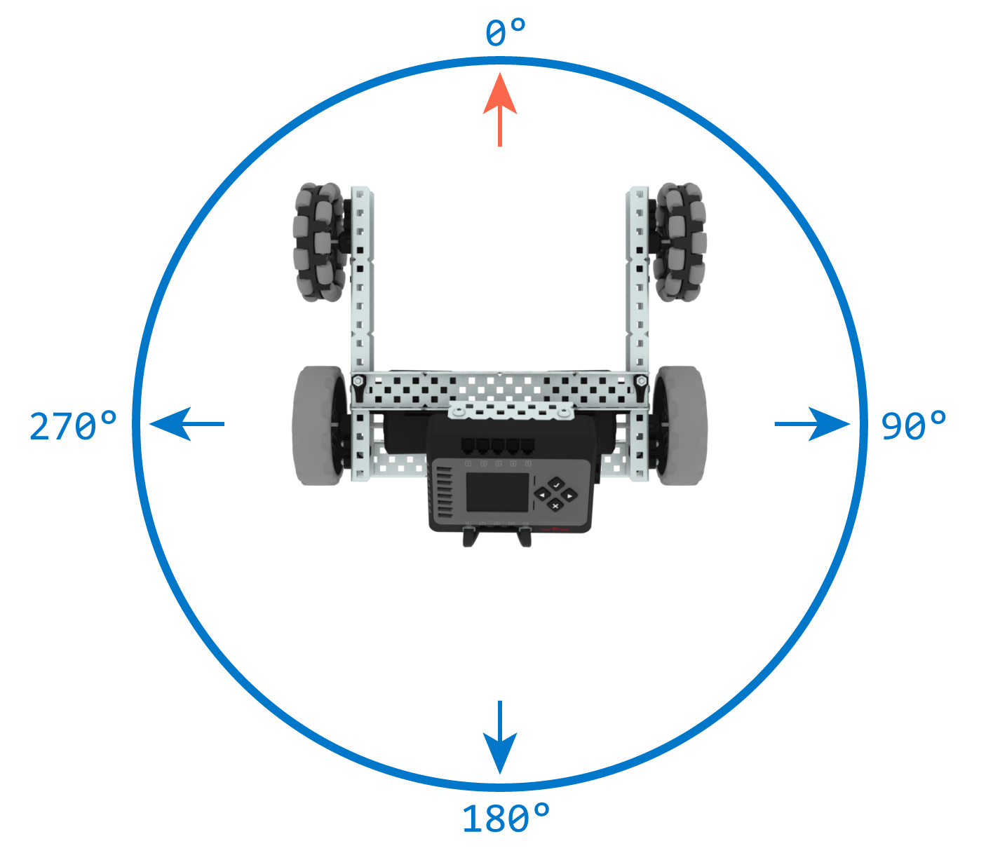

category: drive  
signature: Drivetrain.setHeading(90, degrees);  
device_class: smartdrive  
description: Sets the Gyro of the Drivetrain to an exact heading.  

# Drivetrain Set Heading

Sets the BrainInertial Sensor or Gyro Sensor of the Drivetrain to an exact heading.

```cpp
Drivetrain.setHeading(heading, degrees);
```

## How To Use

The Drivetrain will have a clockwise-positive heading, meaning that heading will increase as the Drivetrain turns right.



`Drivetrain.setHeading` accepts a range of **0 to 359.99** for the `heading` parameter.

## Example 

This example will rotate the robot a total of 135 degrees:

```cpp
Drivetrain.turnToHeading(45.0, degrees);
Drivetrain.setHeading(0.0, degrees);
Drivetrain.turnToHeading(90.0, degrees);
```

- Turn right to heading 45 degrees.
- Set the robot's current heading as heading of 0 degrees.
- Turn right an additional 90 degrees.

<advanced>
</advanced>