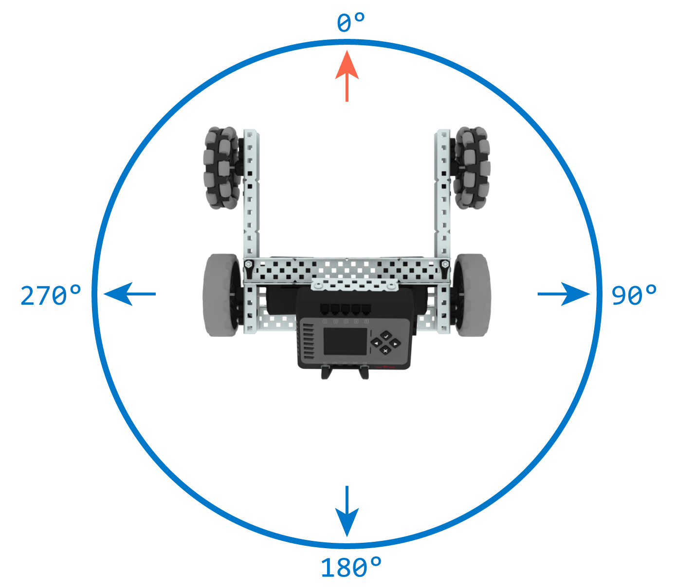

category: drive  
signature: Drivetrain.turnToHeading(90, degrees);  
device_class: smartdrive  
description: Turns a Drivetrain to a specific heading, when using the Gyro or Inertial sensors.

# Drivetrain Turn To Heading

Turns a Drivetrain to a specific heading, when using the Gyro, Inertial Sensor, or BrainInertial.

`Drivetrain.turnToHeading(heading, units);`

## How To Use
The Drivetrain will have a clockwise-positive heading, meaning that heading will increase as the Drivetrain turns right.




`Drivetrain.turnToHeading` accepts a range of **0.00 to 359.99** for the `heading` parameter.

## Example

This example will cause the Drivetrain to make four turns: 

```cpp
Drivetrain.turnToHeading(45.0, degrees);
Drivetrain.turnToHeading(90.0, degrees);
Drivetrain.turnToHeading(270.0, degrees);
Drivetrain.turnToHeading(180.0, degrees);
```
- Right to 45 degrees
- Right to 90 degrees
- Right to 270 degrees
- Left to 180 degrees

The `Drivetrain.turnToHeading` command will by default block other commands until the Drivetrain turn has completed.

## Optional Parameters

You can set `false` as the last parameter to prevent the `Drivetrain.turnToHeading` command from blocking the program until the turn has completed.

```cpp
Drivetrain.turnToHeading(90.0, degrees, false);
```

<advanced>
</advanced>
