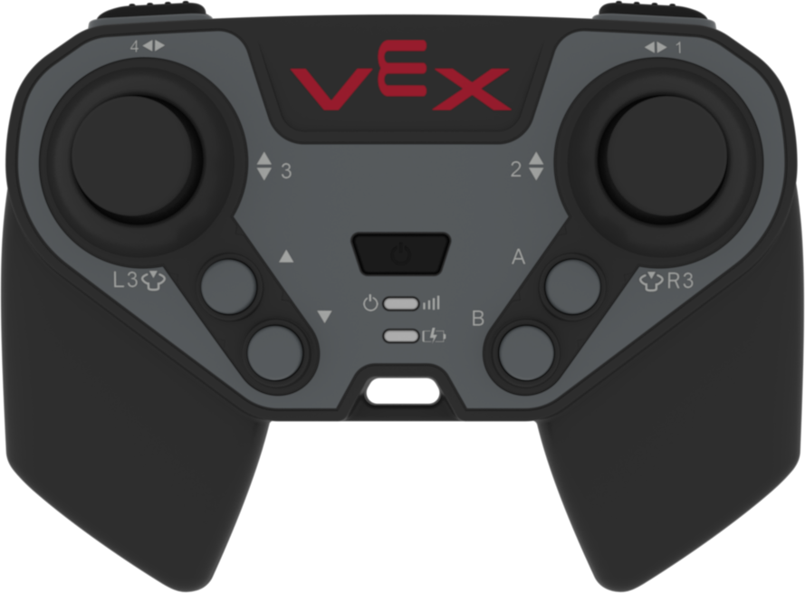
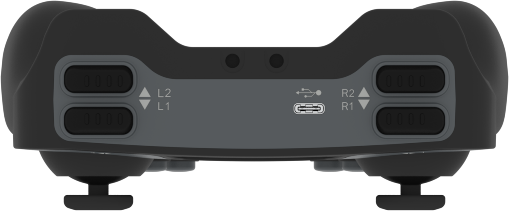

category: events  
signature: CONTROLLER.BUTTON.pressed(callback);  
device_class: controller  
description: Runs the specified function when the controller button is pressed.<br /><br />A user defined callback will need to replace the "callback" parameter in order for this example snippet to compile.  

# Controller Button Pressed

Runs the **callback function** when the VEX EXP Controller button is pressed.

```cpp
Controller.Button.pressed(callback);
```

## How To Use

You will need to create a **callback function** that will be called when a Controller Button is pressed.

```cpp
void buttonPressed() {
  Brain.Screen.print("Button pressed.");
}
```

Choose which Controller button to call the `pressed()` function with.

- `Controller.ButtonL3.pressed(buttonPressed);`
- `Controller.ButtonR3.pressed(buttonPressed);`
- `Controller.ButtonUp.pressed(buttonPressed);`
- `Controller.ButtonDown.pressed(buttonPressed);`
- `Controller.ButtonA.pressed(buttonPressed);`
- `Controller.ButtonB.pressed(buttonPressed);`



- `Controller.ButtonL1.pressed(buttonPressed);`
- `Controller.ButtonL2.pressed(buttonPressed);`
- `Controller.ButtonR1.pressed(buttonPressed);`
- `Controller.ButtonR2.pressed(buttonPressed);`




<advanced>
</advanced>