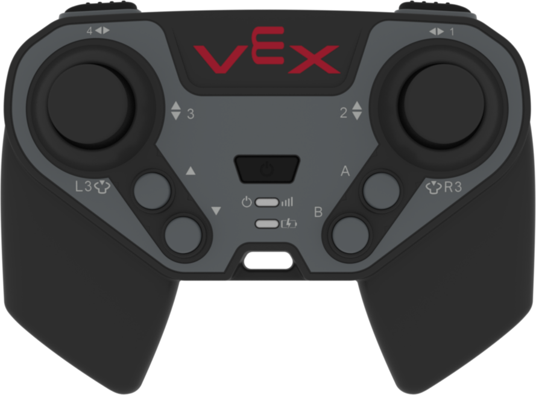
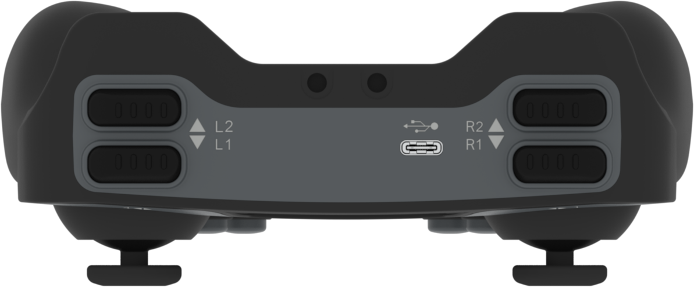

category: events  
signature: CONTROLLER.BUTTON.released(callback);  
device_class: controller  
description: Runs the specified function when the controller button is released.<br /><br />A user defined callback will need to replace the "callback" parameter in order for this example snippet to compile.  

# Controller Button Released
Runs the **callback function** when the VEX EXP Controller Button is released.

```cpp
Controller.Button.released(callback);
```

## How To Use

You will need to create a **callback function** that will be called when a Controller Button is released.

```cpp
void buttonReleased() {
  Brain.Screen.print("Button released.");
}
```

Choose which Controller button to call the `pressed()` function with.

- `Controller.ButtonL3.released(buttonReleased);`
- `Controller.ButtonR3.released(buttonReleased;`
- `Controller.ButtonUp.released(buttonReleased);`
- `Controller.ButtonDown.released(buttonReleased);`
- `Controller.ButtonA.released(buttonReleased);`
- `Controller.ButtonB.released(buttonReleased);`



- `Controller.ButtonL1.released(buttonReleased);`
- `Controller.ButtonL2.released(buttonReleased);`
- `Controller.ButtonR1.released(buttonReleased);`
- `Controller.ButtonR2.released(buttonReleased);`



;`

## Callback Functions

A callback function is a function passed into another function as an argument. The code inside the **callback function** will run whenever the **event** occurs. 

```cpp
void callbackFunction() {
  Brain.Screen.print("Callback Function Called.");
}

int main() {
  Controller.ButtonRDown.released(callbackFunction);
}
```


<advanced>
</advanced>