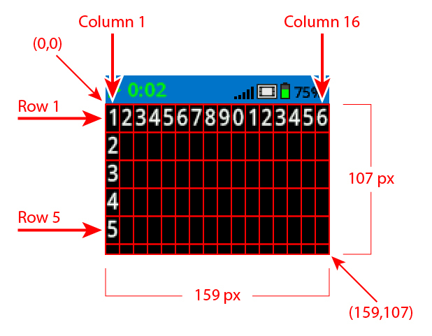

category: looks  
signature: Brain.Screen.drawRectangle(1, 1, 10, 10);  
description: Draws a rectangle on the EXP Brain's screen.  

# Brain Screen Draw Rectangle
Draws a rectangle on the EXP Brain's screen.

```cpp
Brain.Screen.drawRectangle(1, 1, 10, 10);
```

## How To Use

The `Brain.Screen.drawRectangle();` command requires 4 values:

* Value 1: Top Left Corner X coordinate
* Value 2: Top Left Corner Y coordinate
* Value 3: Width of the rectangle
* Value 4: Height of the rectangle

The outside line color of the rectangle is determined by the `Brain.Screen.setPenColor();` command. The default line color is white.

The inside fill color of the rectangle is determine by the `Brain.Screen.setFillColor();` command. The default fill color is black.



<advanced>
</advanced>