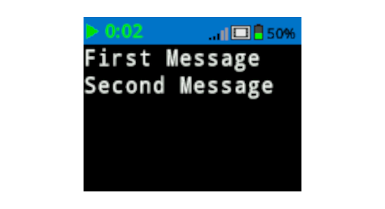

category: looks  
signature: Brain.Screen.newLine();  
description: Sets the print output cursor on the EXP Brain's screen to the next available row.  

# Brain Screen New Line

Sets the print output cursor on the EXP Brain's screen to the next available row.

```cpp
Brain.Screen.newLine();
```

## How To Use

The EXP Brain allows you to change the size of the font printed on the screen. Changing the font will affect the number of rows and columns available on the Brain's screen.

| Font |  | Rows |  | Columns |
| :--- | --- | :--- | --- | :--- |
| Mono Extra Small (mono12) |  | 9 |  | 26 |
| Mono Small (mono15) |  | 7 |  | 20 |
| Mono Medium (mono20) (Default) |  | 5 |  | 16 |
| Mono Large (mono30) |  | 3 |  | 10 |
| Mono Extra Large (mono40) |  | 3 |  | 8 |
| Mono Super Large (mono60) |  | 1 |  | 5 |
| Prop Medium (prop20) |  | 5 |  | 28 |
| Prop Large (prop30) |  | 3 |  | 21 |
| Prop Extra Large (prop40) |  | 2 |  | 15 |
| Prop Super Large (prop60) |  | 1 |  | 9 |

 

## Example

This example will print "First Message" and then will set the cursor to the next available row before printing "Second Message".

```cpp
Brain.Screen.print("First Message");
Brain.Screen.newLine();
Brain.Screen.print("Second Message");
```



<advanced>
</advanced>