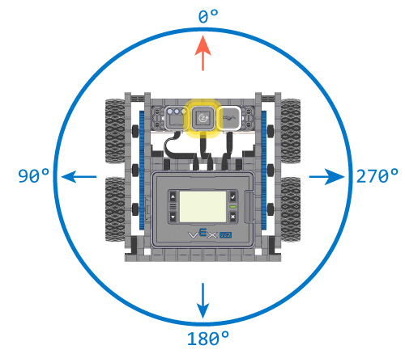
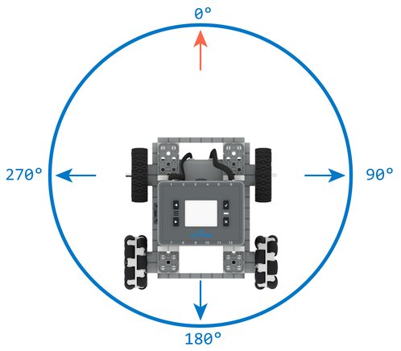
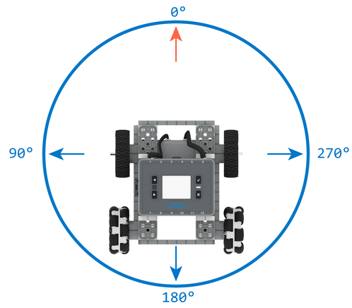

category: drive  
signature: Drivetrain.setHeading(90, degrees);  
device_class: smartdrive  
description: Sets the Gyro of the Drivetrain to an exact heading.  

# Set Heading

Sets the Drivetrain's Gyro heading value.

```cpp
Drivetrain.setHeading(heading, degrees);
```

## How To Use

### IQ (1st generation) Brain

The `Drivetrain.setHeading` command can be used to set the Drivetrain's heading to any given counter-clockwise-positive heading as shown in the image below.



### IQ (2nd generation) Brain

Drivetrain heading references can differ depending on whether a gyro or the integrated inertial sensor is configured in the Drivetrain configuration.

If the Drivetrain is configured with the integrated inertial sensor, the Drivetrain will have a clockwise-positive heading, meaning that heading will increase as the Drivetrain turns right.



Alternatively, if the Drivetrain is configured with a gyro sensor, the Drivetrain will have a counter-clockwise-positive heading, meaning that heading will increase as the Drivetrain turns left.



`Drivetrain.setHeading` accepts a range of **0 to 359.99** for the `heading` parameter.

## Example 

This example will rotate the robot a total of 135 degrees:

```cpp
Drivetrain.turnToHeading(45.0, degrees);
Drivetrain.setHeading(0.0, degrees);
Drivetrain.turnToHeading(90.0, degrees);
```

(The descriptions below are based on an IQ (1st generation) Brain + Drivetrain configuration, or an IQ (2nd generation) Brain + Drivetrain configuration with a gyro sensor)

- Turn left to heading 45 degrees.
- Set the robot's current heading as heading of 0 degrees.
- Turn left an additional 90 degrees.

<advanced>
</advanced>
