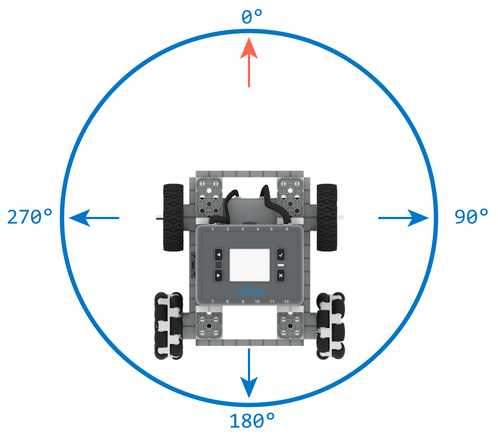
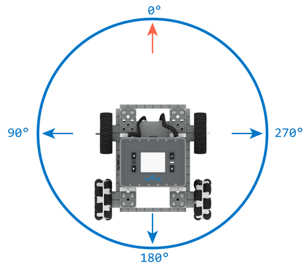

category: drive  
signature: Drivetrain.turnToHeading(90, degrees);  
device_class: smartdrive  
description: Turns a Drivetrain to a specific heading.

# Turn To Heading

Turns a Drivetrain to a specific heading when configured with a VEX IQ Gyro or Brain Inertial Sensor.

`Drivetrain.turnToHeading(heading, degrees);`

## How To Use

### IQ (1st generation) Brain

The `Drivetrain.turnToHeading` command can be used to turn the Drivetrain to any given counter-clockwise heading as shown in the image below.


### IQ (2nd generation) Brain

The `Drivetrain.turnToHeading` command can be used to turn the Drivetrain either in a counter-clockwise or clockwise heading depending on whether the integrated inertial or a gyro sensor is configured in the Drivetrain configuration.

If the Drivetrain is configured with the integrated inertial sensor, the Drivetrain will have a clockwise-positive heading, meaning that heading will increase as the Drivetrain turns right.



Alternatively, if the Drivetrain is configured with a gyro sensor, the Drivetrain will have a counter-clockwise-positive heading, meaning that heading will increase as the Drivetrain turns left.



Based on the current heading of the Gyro, `Drivetrain.turnToHeading` will determine which direction to turn.

`Drivetrain.turnToHeading` accepts a range of **0.00 to 359.99** for the `heading` parameter.

## Example

This example will cause the Drivetrain to make four turns: 

```cpp
Drivetrain.turnToHeading(45.0, degrees);
Drivetrain.turnToHeading(90.0, degrees);
Drivetrain.turnToHeading(270.0, degrees);
Drivetrain.turnToHeading(180.0, degrees);
```

- Left (counter-clockwise) to 45 degrees
- Left (counter-clockwise) to 90 degrees
- Left (counter-clockwise) to 270 degrees
- Right (clockwise) to 180 degrees

(The clockwise/counter-clockwise motions described above are based on an IQ (1st generation) Brain + Drivetrain configuration, or an IQ (2nd generation) Brain + Drivetrain configuration with a gyro sensor)

The `Drivetrain.turnToHeading` command will by default block other commands until the Drivetrain turn has completed.

## Optional Parameters

You can set `false` as the last parameter to prevent the `Drivetrain.turnToHeading` command from blocking the program until the turn has completed.

```cpp
Drivetrain.turnToHeading(90.0, degrees, false);
```

<advanced>
</advanced>
