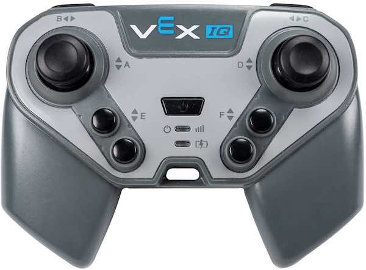
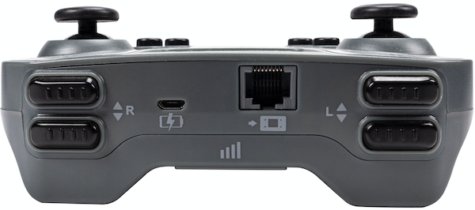

category: events  
signature: Controller.Button.pressed();  
description: Runs the callback function when the Controller button is pressed.<br /><br />A user defined callback will need to replace the "callback" parameter in order for this example snippet to compile.

# Controller Button Pressed

Runs the **callback function** when the VEX IQ Controller button is pressed.

```cpp
Controller.Button.pressed(callback);
```

## How To Use

You will need to create a **callback function** that will be called when a Controller Button is pressed.

```cpp
void buttonPressed() {
  Brain.Screen.print("Button pressed.");
}
```

Choose which Controller button to call the `pressed()` function with.



- `Controller.ButtonEUp.pressed(buttonPressed);`
- `Controller.ButtonEDown.pressed(buttonPressed);`
- `Controller.ButtonFUp.pressed(buttonPressed);`
- `Controller.ButtonFDown.pressed(buttonPressed);`



- `Controller.ButtonLUp.pressed(buttonPressed);`
- `Controller.ButtonLDown.pressed(buttonPressed);`
- `Controller.ButtonRUp.pressed(buttonPressed);`
- `Controller.ButtonRDown.pressed(buttonPressed);`

<advanced>
</advanced>