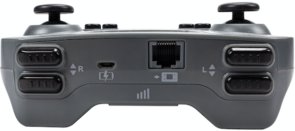

category: events  
signature: Controller.Button.released();  
description: Runs the callback function when the Controller button is released.<br /><br />A user defined callback will need to replace the "callback" parameter in order for this example snippet to compile.

# Controller Button Released

Runs the **callback function** when the VEX IQ Controller Button is released.

```cpp
Controller.Button.released(callback);
```

## How To Use

You will need to create a **callback function** that will be called when a Controller Button is released.

```cpp
void buttonReleased() {
  Brain.Screen.print("Button released.");
}
```

Choose which Controller button to call the `released()` function with.

- `Controller.ButtonEUp.released(buttonReleased);`
- `Controller.ButtonEDown.released(buttonReleased);`
- `Controller.ButtonFUp.released(buttonReleased);`
- `Controller.ButtonFDown.released(buttonReleased);`
- `Controller.ButtonLUp.released(buttonReleased);`
- `Controller.ButtonLDown.released(buttonReleased);`
- `Controller.ButtonRUp.released(buttonReleased);`
- `Controller.ButtonRDown.released(buttonReleased);`




## Callback Functions

A callback function is a function passed into another function as an argument. The code inside the **callback function** will run whenever the **event** occurs. 

```cpp
void callbackFunction() {
  Brain.Screen.print("Callback Function Called.");
}

int main() {
  Controller.ButtonRDown.released(callbackFunction);
}
```

<advanced>
</advanced>