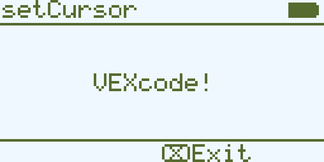
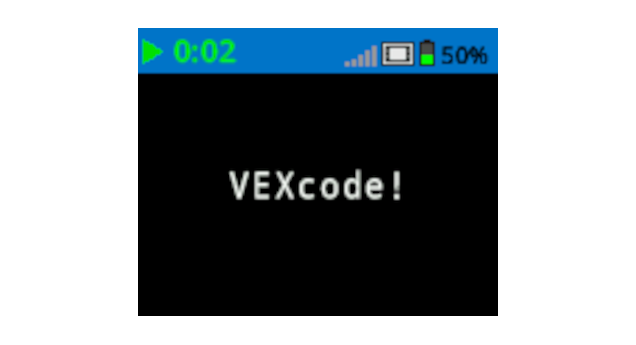

category: looks  
signature: Brain.screen.setCursor(1, 1);  
description: Sets the cursor location for Brain.Screen.print(); command on the IQ Brain's screen.

# Set Cursor

Sets the cursor location for `Brain.Screen.print` commands.

```cpp
Brain.Screen.setCursor(row, col);
```

## How To Use

The `Brain.Screen.setCursor` command requires 2 parameters:

* Parameter 1: Screen row position 
* Parameter 2: Screen column position

Set the cursor's row and column position to have a `Brain.Screen.print` command print at a specific location on the screen.

### IQ (1st generation) Brain
Accepts a range for `row` of **1 to 5** .

Accepts a range for `col` of **1 to 21**.

### IQ (2nd generation) Brain

The IQ (2nd generation) Brain allows you to change the size of the font printed on the screen. Changing the font will affect the number of rows and columns available on the Brain's screen.

| Font |  | Rows |  | Columns |
| :--- | --- | :--- | --- | :--- |
| Mono Extra Small (mono12) |  | 9 |  | 26 |
| Mono Small (mono15) |  | 7 |  | 20 |
| Mono Medium (mono20) (Default) |  | 5 |  | 16 |
| Mono Large (mono30) |  | 3 |  | 10 |
| Mono Extra Large (mono40) |  | 3 |  | 8 |
| Mono Super Large (mono60) |  | 1 |  | 5 |
| Prop Medium (prop20) |  | 5 |  | 28 |
| Prop Large (prop30) |  | 3 |  | 21 |
| Prop Extra Large (prop40) |  | 2 |  | 15 |
| Prop Super Large (prop60) |  | 1 |  | 9 |

Accepts a range for `row` of **1 to 9**.

Accepts a range for `col` of **1 to 28**.

## Example 1

This example will set the cursor to location row 3 column 7 before printing the text "VEXcode!" to the Brain's screen.

```cpp
Brain.Screen.setCursor(3, 7);
Brain.Screen.print("VEXcode!");
```



## Example 2

This example will set the cursor to location row 3 column 5 before printing the text "VEXcode!" to the Brain's screen.

```cpp
Brain.Screen.setCursor(3, 5);
Brain.Screen.print("VEXcode!");
```



<advanced>
</advanced>