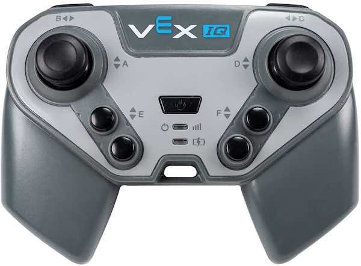

category: sensing  
signature: Controller.Button.pressing()  
device_class: controller  
description: Reports if a button on the Controller is pressed.

# Controller Button Pressing

Reports if the specified button on the VEX IQ's Controller is being pressed.

```cpp
Controller.Button.pressing()
```

## How To Use

Choose which Controller button to detect a press on.



- `Controller.ButtonEUp.pressing()`
- `Controller.ButtonEDown.pressing()`
- `Controller.ButtonFUp.pressing()`
- `Controller.ButtonFDown.pressing()`


- `Controller.ButtonLUp.pressing()`
- `Controller.ButtonLDown.pressing()`
- `Controller.ButtonRUp.pressing()`
- `Controller.ButtonRDown.pressing()`

`Controller.Button.pressing()` reports **true** if the specified Controller button is being pressed.

`Controller.Button.pressing()` reports **false** if the specified Controller button is not being pressed.

## Example

The example below drives the VEX IQ robot forward. If the Controller's ButtonEUp button is pressed, the robot will then stop driving.

```cpp
Drivetrain.drive(forward);

while (true) {
  if (Controller.ButtonEUp.pressing()) {
    Drivetrain.stop();
    break;
  }

  wait(20, msec);
}

```

<advanced>
</advanced>