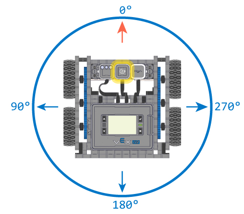
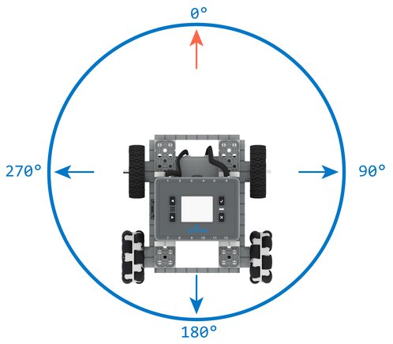
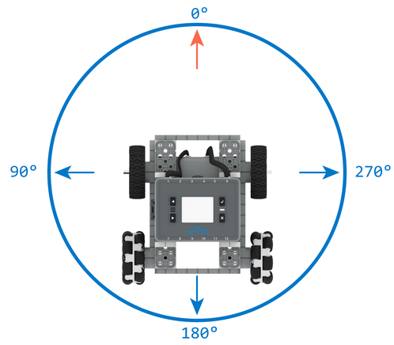

category: sensing  
signature: Drivetrain.heading(degrees)  
description: Reports the Drivetrain's heading.

# Drive Heading

Reports the heading that the Drivetrain is facing.

```cpp
Drivetrain.heading(degrees)
```

## How To Use

`Drivetrain.heading` reports a range from **0.00 to 359.99 degrees**.

### IQ (1st generation) Brain

The `Drivetrain.heading` command reports a counter-clockwise-positive heading as shown in the image below.



### IQ (2nd generation) Brain

The `Drivetrain.heading` command can report a counter-clockwise or clockwise heading depending on whether intergrated brain inertial or a gyro sensor is configured in the Drivetrain configuration.

If the Drivetrain is configured with the integrated inertial sensor, the Drivetrain will have a clockwise-positive heading, meaning that heading will increase as the Drivetrain turns right.



Alternatively, if the Drivetrain is configured with a gyro sensor, the Drivetrain will have a counter-clockwise-positive heading, meaning that heading will increase as the Drivetrain turns left.




## Example

The example below prints the heading of the Drivetrain to the VEX IQ brain's screen.

```cpp
Drivetrain.turn(left);

while (true) {
  Brain.Screen.clearScreen();
  Brain.Screen.setCursor(1, 1);
  Brain.Screen.print("Drivetrain Heading: %.2f", Drivetrain.heading(degrees));

  // Brief delay to prevent print distortion or tearing
  wait(20, msec);
}
```

<advanced>
</advanced>
