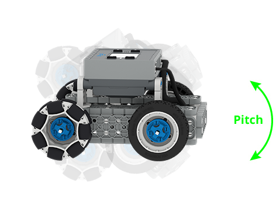
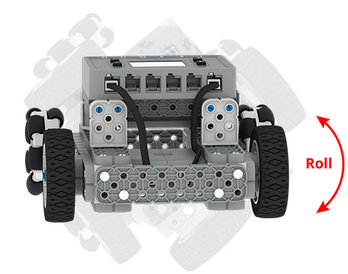
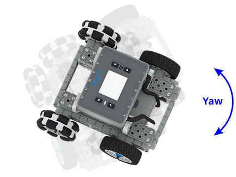

category: sensing  
signature: INERTIAL.orientation(pitch, degrees);  
device_class: inertial  
description: Gets an orientation angle of the IQ (2nd generation) Brain Inertial Sensor. Reports the unit value specified by the parameter of the IQ (2nd generation) Brain Inertial Sensor.

# Inertial Orientation

Gets an orientation angle of the IQ (2nd generation) Brain Inertial Sensor. Reports the unit value specified by the parameter of the IQ (2nd generation) Brain Inertial Sensor.

The orientation reported is determined by the selected axis (x, y, or z).

* The **X-axis** represents **pitch**, which reports a value between -90 to +90 degrees.
* The **Y-axis** represents **roll**, which reports a value between -180 to +180 degrees)
* The **Z-axis** represents **yaw**, which reports a value between -180 to +180 degrees)

---

Pitch is the rotation around the side to side axis.



Roll is the rotation around the front to back axis.



Yaw is rotation around the vertical axis.



---

```cpp
BrainInertial.orientation(axis, units)
```

## How To Use

Commands that return a value are normally used inside of other statements (such as print statements) or inside of control structures (such as while loops) and do not use a semicolon

```cpp
while(!(BrainInertial.orientation(yaw, degrees) > 60));
Drivetrain.drive(forward);
```

<advanced>
</advanced>
