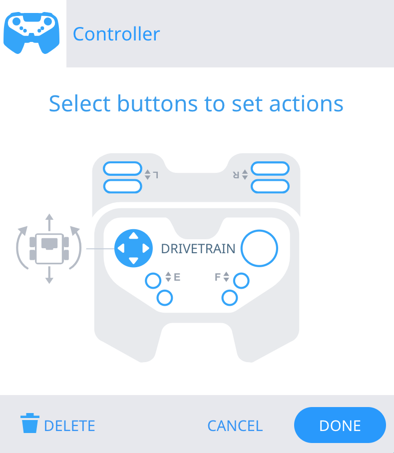

category: sensing  
signature: RemoteControlCodeEnabled = true;  
description: Enables or disables Controller configured actions from the Devices menu.

# Controller Enable/Disable

```cpp
RemoteControlCodeEnabled = false;
```

Enables or disables Controller-configured actions from the Devices menu.

## How To Use

Choose to either enable or disable the configured Controller actions by declaring it as either `true` or `false`. By default, the Controller is Enabled in every project.

## Example

The configured action in this example is using the robot's Drivetrain behavior set by the Controller's configuration in the Devices window.



This example will have the configured Controller disabled when the program starts. 

Then, the robot will drive forward for 6 inches.

Finally, the **controller enabled** command will enable the Controller to restore Controller driving behaviors.

```cpp
RemoteControlCodeEnabled = false;
Drivetrain.driveFor(forward, 6.0, inches);
RemoteControlCodeEnabled = true;
```

<advanced>
</advanced>