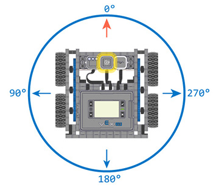

category: drive  
signature: Drivetrain.turnToHeading(90, degrees);  
device_class: smartdrive  
description: Turns a Drivetrain to a specific heading.

# Käänny ajosuuntaan

Kääntää ajopeliä tiettyyn ajosuuntaan VEX IQ Gyron avulla.

`Drivetrain.turnToHeading(heading, degrees);`

## Miten käytetään

`Drivetrain.turnToHeading` komentoa voi käyttää, kun kääntää ajopeliä tiettyyn vastapäiväiseen ajosuuntaan kuten kuvassa.



Perustuu nykyiseen ajosuuntaan, komento `Drivetrain.turnToHeading` määrää mihin suuntaan käännytään.

`Drivetrain.turnToHeading` hyväksyy arvot väliltä **0.00 - 359.99** ajosuunta parametriksi.

## Esimerkki

Esimerkissä ajopeli tekee 4 kääntymistä: 

```cpp
Drivetrain.turnToHeading(45.0, degrees);
Drivetrain.turnToHeading(90.0, degrees);
Drivetrain.turnToHeading(270.0, degrees);
Drivetrain.turnToHeading(180.0, degrees);
```

- Vasemmalle (vastapäivään) arvoon 45 astetta
- Vasemmalle (vastapäivään) arvoon 90 astetta
- Vasemmalle (vastapäivään) arvoon 270 astetta
- Oikealle (myötäpäivään) arvoon 180 astetta

`Drivetrain.turnToHeading` komento estää seuraavien komentojen suorituksen kunnes oma kääntyminen on tehty loppuun.

## Lisäparametrit

Voit asettaa lisäparametrin `false`, jolloin se estää `Drivetrain.turnToHeading` komennon seuraavien komentojen blokkaamisen kesken käännöksen.

```cpp
Drivetrain.turnToHeading(90.0, degrees, false);
```

<advanced>
</advanced>
