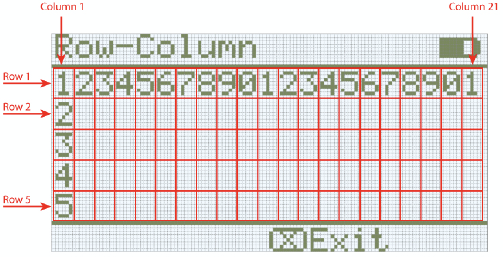
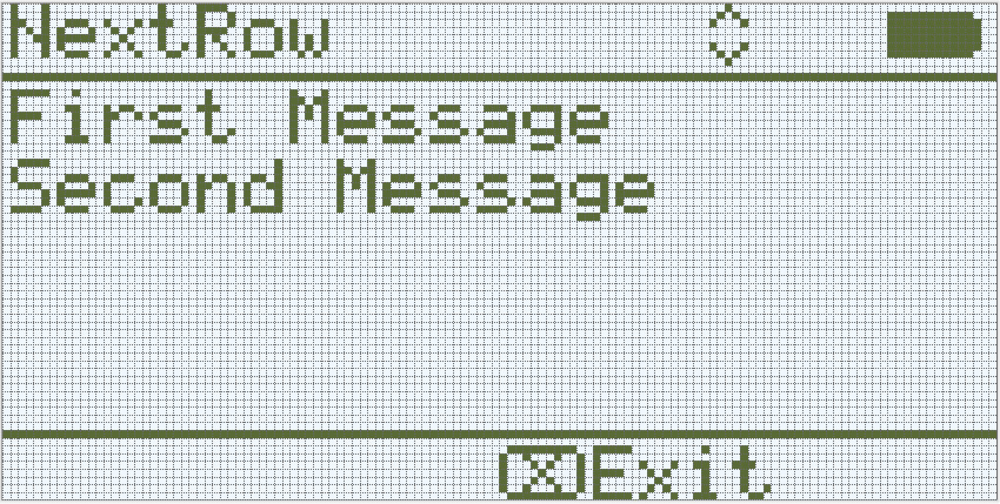

category: looks  
signature: Brain.Screen.newLine();  
description: Sets the print output cursor on the IQ Brain's screen to the next available row.  

# Uusi rivi

Asettaa tulostuksen kursorin rivin näytöllä seuraavalle riville.

```cpp
Brain.Screen.newLine();
```

## Miten käytetään

Oletuksena ohjelman alussa näytön kursori on rivillä 1 sarakkeessa 1. `Brain.Screen.newLine` komento siirtää kursoria näytön seuraavalle riville alaspäin.

---

  

## Esimerkki

Esimerkissä tulostetaan "First Message" ja siirretään kursori seuraavalle riville ja tulostetaan  "Second Message".

```cpp
Brain.Screen.print("First Message");
Brain.Screen.newLine();
Brain.Screen.print("Second Message");
```



<advanced>
</advanced>