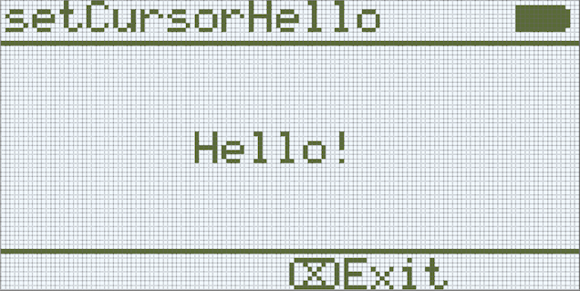

category: looks  
signature: Brain.screen.setCursor(1, 1);  
description: Sets the cursor location for Brain.Screen.print(); command on the V5 Brain's screen.

# Aseta kursorin paikka

Asettaa kursorin paikan `Brain.Screen.print` komennossa.

```cpp
Brain.Screen.setCursor(row, col);
```

## Miten käytetään

`Brain.Screen.setCursor` komento tarvitsee 2 parametria:

* Parametri 1: Näytön rivinumero 
* Parametri 2: Näytön sarakenumero

Aseta rivi- ja sarakearvot `Brain.Screen.print` komennossa, kun haluat tulostaa tiettyy pisteeseen näytöllä.

Rivn arvot välillä **1 - 5**.

Sarakearvot välillä **1 - 21**.

## Esimerkki

Esimerkissä kursori(näytön osoitin) asetataan arvoon rivi 3 sarake 8 ennenkuin tulostetaan teksti "Hello!" Aivojen näytölle.

```cpp
Brain.Screen.setCursor(3, 8);
Brain.Screen.print("Hello!");
```

  

<advanced>
</advanced>