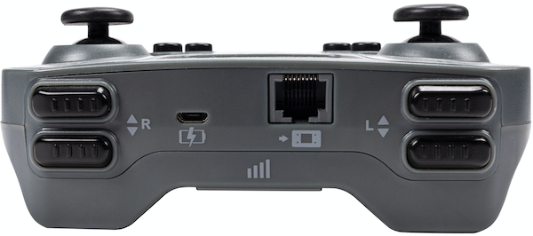

category: sensing  
signature: Controller.Button.pressing()  
device_class: controller  
description: Reports if a button on the Controller is pressed.

# Ohjain Nappia painettu

Raportoi, onko tiettyä ohjainnappia painettu.

```cpp
Controller.Button.pressing()
```

## Miten käytetään

Valise ohjaimen nimetty nappi, jota seurataan.


- `Controller.ButtonEUp.pressing()`
- `Controller.ButtonEDown.pressing()`
- `Controller.ButtonFUp.pressing()`
- `Controller.ButtonFDown.pressing()`



- `Controller.ButtonLUp.pressing()`
- `Controller.ButtonLDown.pressing()`
- `Controller.ButtonRUp.pressing()`
- `Controller.ButtonRDown.pressing()`

`Controller.Button.pressing()` raportoi arvon **tosi** jos nimettyä ohjainnappia on painettu.

Controller.Button.pressing()` raportoi arvon **epätosi** jos nimettyä ohjainnappia ei ole painettu.

## Esimerkki

Esimerkissä ajopeli liikkuu eteenpäin. Jos ohjaimen nappia E Ylös on painettu , robotti pysähtyy.

```cpp
Drivetrain.drive(forward);

while (true) {
  if (Controller.ButtonEUp.pressing()) {
    Drivetrain.stop();
    break;
  }

  wait(20, msec);
}

```

<advanced>
</advanced>