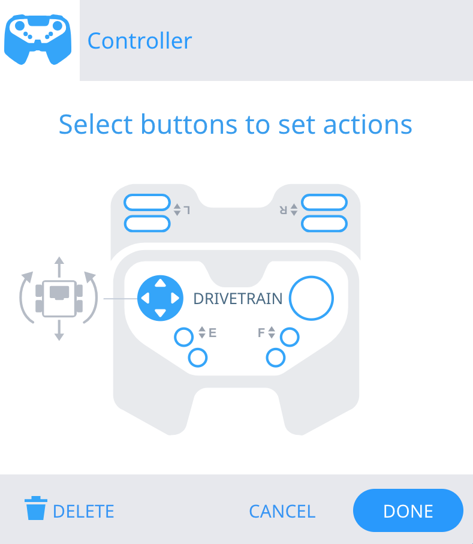

category: sensing  
signature: RemoteControlCodeEnabled = true;  
description: Enables or disables Controller configured actions from the Devices menu.

# Ohjain Käytössä/Poissa käytöstä

```cpp
RemoteControlCodeEnabled = false;
```

Ottaa käyttöön tai poistaa Laitteet -ikkunassa Ohjain-määritellyt painikkeet.

## Miten käytetään

Valitse joko käytössä tai pois käytöstä Ohjain-määritellyt painonapit ja tatit. Arvo onjoko `tosi` tai `epätosi`. Oletuksena Ohjain on aina käytössä.  

## Esimerkki

Tässä esimerkissä on Laitteeet -ikkunassa ajopelin ohjaukseen tehdyt Ohjain-määritykset.



Ohjelmassa tehdyt Ohjain-määritykset otetaan pois kun ohjelma alkaa. 

Sen jälkeen robotti ajaa 6 tuumaa eteenpäin.

Lopussa ohjain on taas **Ohjain käytössä** -komento määritelty ja tulee voimaan ja ajopeliä voi ohjata ohjaimella.

```cpp
RemoteControlCodeEnabled = false;
Drivetrain.driveFor(forward, 6.0, inches);
RemoteControlCodeEnabled = true;
```

<advanced>
</advanced>