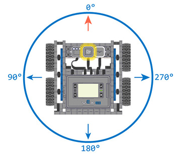

category: drive  
signature: Drivetrain.turnToHeading(90, degrees);  
device_class: smartdrive  
description: Turns a Drivetrain to a specific heading.

# Turn To Heading

Повертає трансмісію на визначений курс, якщо налаштовано гіроскопічний датчик VEX IQ.

`Drivetrain.turnToHeading(heading, degrees);`

## Як це працює

Команду `Drivetrain.turnToHeading` використовують, щоб повернути трансмісію на введене значення курсу, яке рахується в напрямку проти годинникової стрілки, як показано на зображенні.



Зважаючи на поточну позицію гіродатчика, `Drivetrain.turnToHeading` самостійно обере напрямок обертання.

`Drivetrain.turnToHeading` приймає значення в діапазоні **від 0.00 до 359.99** для параметра `heading`.

## Приклад

Цей приклад змусить трансмісію здійснити чотири повороти: 

```cpp
Drivetrain.turnToHeading(45.0, degrees);
Drivetrain.turnToHeading(90.0, degrees);
Drivetrain.turnToHeading(270.0, degrees);
Drivetrain.turnToHeading(180.0, degrees);
```

- Ліворуч (проти годинникової) до 45 градусів
- Ліворуч (проти годинникової) до 90 градусів
- Ліворуч (проти годинникової) до 270 градусів
- Праворуч (за годинниковою) до 180 градусів

Команда `Drivetrain.turnToHeading` за замовчуванням блокує інші команди, поки трансмісія повертає.

## Необов'язкові параметри

Ви можете встановити значення останнього параметра `false`, щоб команда `Drivetrain.turnToHeading` не блокувала програму під час виконання руху.

```cpp
Drivetrain.turnToHeading(90.0, degrees, false);
```

<advanced>
</advanced>
