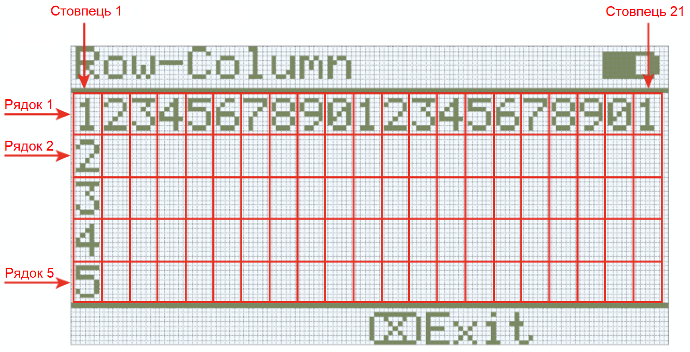

category: looks  
signature: Brain.Screen.clearLine();  
description: Clears a single row on the Brain screen.  

# Clear Line

Очищує поточний рядок на екрані VEX IQ Brain.

```cpp
Brain.Screen.clearLine();
```

Очищує обраний рядок на екрані Brain.

```cpp
Brain.Screen.clearLine(1);
```

## Як це працює

Команда `Brain.Screen.clearLine` приймає цілі значення **від 1 до 5** щоб очистити відповідний рядок.

Ви можете викликати команду без аргумента, щоб очистити поточний рядок.

  

## Приклад 
Цей приклад надрукує "Hello" у рядку 2, стовпчика 1, почекає 3 секунди, а потім очистить рядок 2.

```cpp
Brain.Screen.setCursor(2, 1);
Brain.Screen.print("Hello");
wait(3.0, seconds);
Brain.Screen.clearLine(2);
```

<advanced>
</advanced>