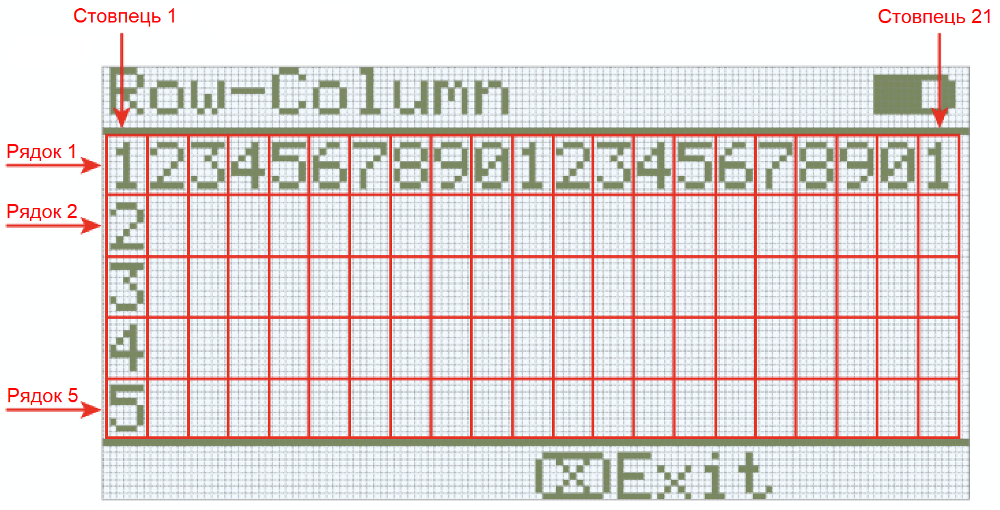
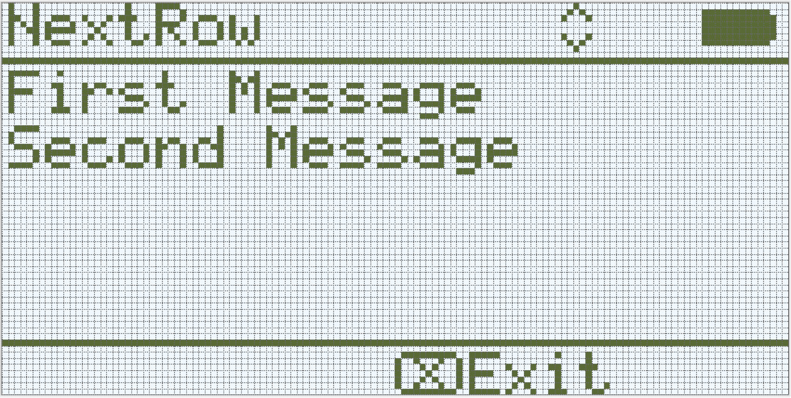

category: looks  
signature: Brain.Screen.newLine();  
description: Sets the print output cursor on the IQ Brain's screen to the next available row.  

# New Line

Встановлює курсор для друку на екрані Brain в наступний доступний рядок.

```cpp
Brain.Screen.newLine();
```

## Як це працює

За замовчуванням, усі проєкти починають із курсором в рядку 1 стовпці 1. Команда `Brain.Screen.newLine` переміщує курсор на рядок нижче на екрані Brain.

---

  

## Приклад

Цей приклад надрукує "First Message" і встановить курсор у наступний доступний рядок перед друком "Second Message".

```cpp
Brain.Screen.print("First Message");
Brain.Screen.newLine();
Brain.Screen.print("Second Message");
```



<advanced>
</advanced>