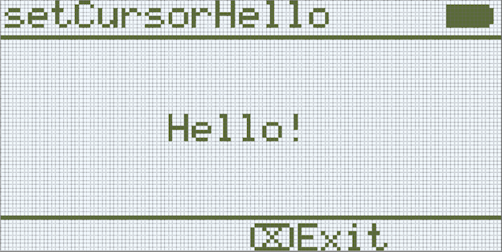

category: looks  
signature: Brain.screen.setCursor(1, 1);  
description: Sets the cursor location for Brain.Screen.print(); command on the V5 Brain's screen.

# Set Cursor

Встановлює позицію курсора для команди `Brain.Screen.print`.

```cpp
Brain.Screen.setCursor(row, col);
```

## Як це працює

Команда `Brain.Screen.setCursor` потребує 2 параметра:

* Параметр 1: Позиція рядка на екрані 
* Параметр 2: Позиція стовпчика на екрані

Встановіть позицію курсора в рядку і стовпчику, щоб команда `Brain.Screen.print` друкувала в потрібній позиції на екрані.

Допустимий діапазон для рядка `row` **від 1 до 5**.

Допустимий діапазон для стовпчика `col` **від 1 до 21**.

## Приклад 

Цей приклад встановлює позицію курсора в рядок 3, стовпчик 8, а потім друкує текст "Hello!" на екрані Brain.

```cpp
Brain.Screen.setCursor(3, 8);
Brain.Screen.print("Hello!");
```

  

<advanced>
</advanced>