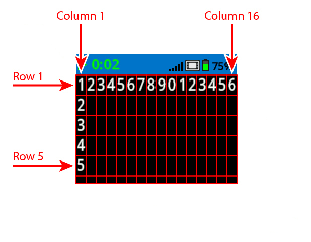

category: looks  
signature: brain.screen.clear_row(ROW)  
description: Clears a single row on the VEX IQ Brain's screen  

# Clear Line

Clears the current row on the VEX IQ Brain's Screen.

```python
brain.screen.clear_row()
```

Clears a specified row on the VEX IQ Brain's screen.

```python
brain.screen.clear_row(ROW)
```

## How To Use

You can call the `Clear Line` command without any arguments to clear the current row.

### IQ (2nd generation) Brain

The IQ (2nd generation) Brain allows you to change the size of the font printed on the screen. Changing the font will affect the number of rows and columns available on the Brain's screen.

| Font |  | Rows |  | Columns |
| :--- | --- | :--- | --- | :--- |
| Mono Extra Small (mono12) |  | 9 |  | 26 |
| Mono Small (mono15) |  | 7 |  | 20 |
| Mono Medium (mono20) (Default) |  | 5 |  | 16 |
| Mono Large (mono30) |  | 3 |  | 10 |
| Mono Extra Large (mono40) |  | 3 |  | 8 |
| Mono Super Large (mono60) |  | 1 |  | 5 |
| Prop Medium (prop20) |  | 5 |  | 28 |
| Prop Large (prop30) |  | 3 |  | 21 |
| Prop Extra Large (prop40) |  | 2 |  | 15 |
| Prop Super Large (prop60) |  | 1 |  | 9 |

`Clear Line` accepts a range of values from **1 to 9** for the row to clear, depending on what font is currently selected.

 

## Example 

This example will print "Hello" on row 2, column 1, wait for three seconds, then clear row 2.

```python
brain.screen.set_cursor(2, 1)
brain.screen.print("Hello")
wait(3, SECONDS)
brain.screen.clear_row(2)
```

<advanced>
</advanced>