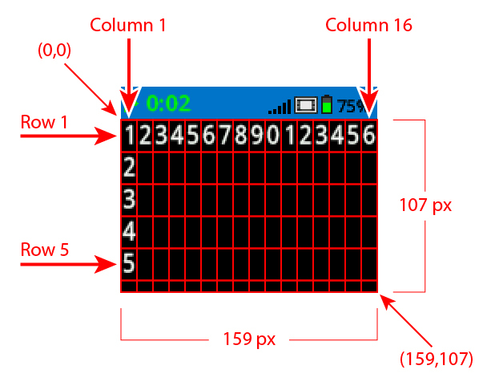

category: looks  
signature: brain.screen.draw_circle(X, Y, RADIUS)  
description: Draws a circle on the IQ (2nd generation) Brain's screen  

# Brain Screen Draw Circle

Draws a circle on the IQ (2nd generation) Brain's screen.

```python
brain.screen.draw_circle(X, Y, RADIUS)
```

## How To Use

The `Brain Screen Draw Circle` command requires 3 values:

* **X**: X coordinate of the circle's center
* **Y**: Y coordinate of the circle's center
* **RADIUS**: Radius of circle (in pixels)



The outside line color of the circle is determined by the Brain's `Set Pen Color` command. The default line color is white.

The inside fill color of the circle is determined by the Brain's `Set Fill Color` command. The default fill color is black.

<advanced>
</advanced>