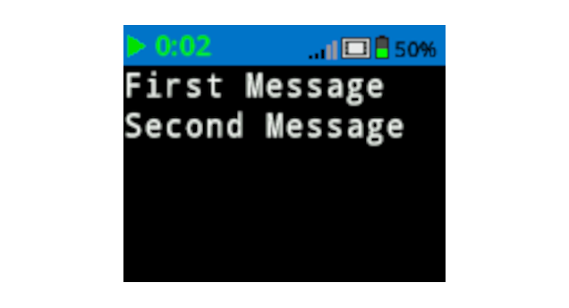

category: looks  
signature: brain.screen.next_row()  
description: Sets the print output cursor on the IQ Brain's screen to the next available row  

# New Line

Sets the print output cursor on the IQ Brain's screen to the next available row.

```python
brain.screen.next_row()
```

## How To Use

By default, all projects begin with the screen cursor at row 1 column 1. The `New Line` command will move the cursor down by a single row on the screen.

The IQ (2nd generation) Brain allows you to change the size of the font printed on the screen. Changing the font will affect the number of rows and columns available on the Brain's screen.

| Font |  | Rows |  | Columns |
| :--- | --- | :--- | --- | :--- |
| Mono Extra Small (mono12) |  | 9 |  | 26 |
| Mono Small (mono15) |  | 7 |  | 20 |
| Mono Medium (mono20) (Default) |  | 5 |  | 16 |
| Mono Large (mono30) |  | 3 |  | 10 |
| Mono Extra Large (mono40) |  | 3 |  | 8 |
| Mono Super Large (mono60) |  | 1 |  | 5 |
| Prop Medium (prop20) |  | 5 |  | 28 |
| Prop Large (prop30) |  | 3 |  | 21 |
| Prop Extra Large (prop40) |  | 2 |  | 15 |
| Prop Super Large (prop60) |  | 1 |  | 9 |

 

## Example

This example will print "First Message" and then will set the cursor to the next available row before printing "Second Message".

```python
brain.screen.print("First Message")
brain.screen.next_row()
brain.screen.print("Second Message")
```



<advanced>
</advanced>