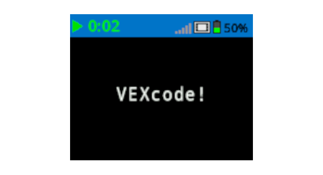

category: looks  
signature: brain.screen.set_cursor(ROW, COL)  
description: Sets the cursor location for the `Print` command on the IQ Brain's screen.

# Set Cursor

Sets the cursor location for Brain's `Print` commands.

```python
brain.screen.set_cursor(ROW, COL)
```

## How To Use

The `Set Cursor` command requires 2 parameters:

* **ROW**: Screen row position 
* **COL**: Screen column position

Set the cursor's row and column position to have a `Print` command print at a specific location on the screen.

The IQ (2nd generation) Brain allows you to change the size of the font printed on the screen. Changing the font will affect the number of rows and columns available on the Brain's screen.

| Font |  | Rows |  | Columns |
| :--- | --- | :--- | --- | :--- |
| Mono Extra Small (mono12) |  | 9 |  | 26 |
| Mono Small (mono15) |  | 7 |  | 20 |
| Mono Medium (mono20) (Default) |  | 5 |  | 16 |
| Mono Large (mono30) |  | 3 |  | 10 |
| Mono Extra Large (mono40) |  | 3 |  | 8 |
| Mono Super Large (mono60) |  | 1 |  | 5 |
| Prop Medium (prop20) |  | 5 |  | 28 |
| Prop Large (prop30) |  | 3 |  | 21 |
| Prop Extra Large (prop40) |  | 2 |  | 15 |
| Prop Super Large (prop60) |  | 1 |  | 9 |

Accepts a range for **ROW** of **1 to 9**.

Accepts a range for **COL** of **1 to 28**.

## Example

This example will set the cursor to location row 3 column 5 before printing the text "VEXcode!" to the Brain's screen.

```python
brain.screen.set_cursor(3, 5)
brain.screen.print("VEXcode!")
```



<advanced>
</advanced>