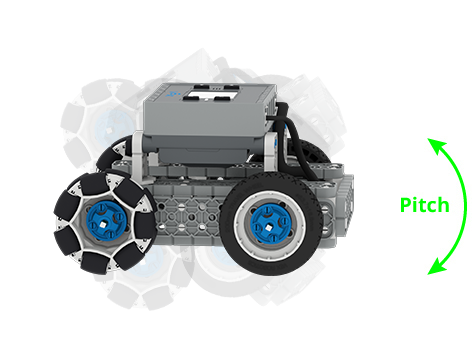
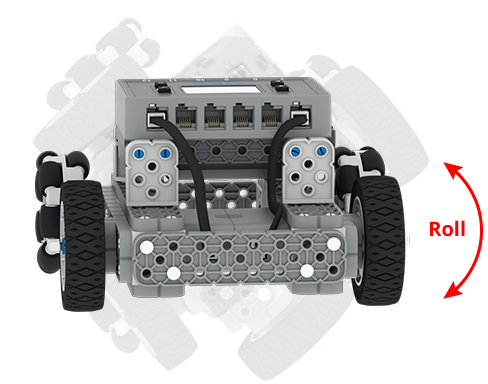
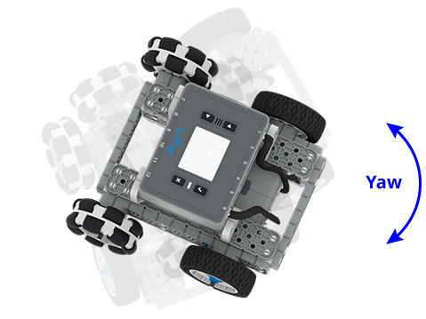

category: sensing  
signature: inertial.orientation(TYPE, DEGREES)  
device_class: inertial  
description: Gets an orientation angle of the VEX IQ (2nd generation) Brain's Inertial Sensor  

# Inertial Orientation

Gets an orientation angle of the VEX IQ (2nd generation) Brain's Inertial Sensor.

```python
brain_inertial.orientation(TYPE, DEGREES)
```

## How To Use

The orientation reported is determined by the selected axis (x, y, or z). Replace the **TYPE** parameter with one of the following options:

* **OrientationType.PITCH**: represents **pitch**, which reports a value between -90 to +90 degrees.
* **OrientationType.ROLL**: represents **roll**, which reports a value between -180 to +180 degrees)
* **OrientationType.YAW**: represents **yaw**, which reports a value between -180 to +180 degrees)

---

Pitch is the rotation around the side to side axis.



Roll is the rotation around the front to back axis.



Yaw is rotation around the vertical axis.



<advanced>
</advanced>
