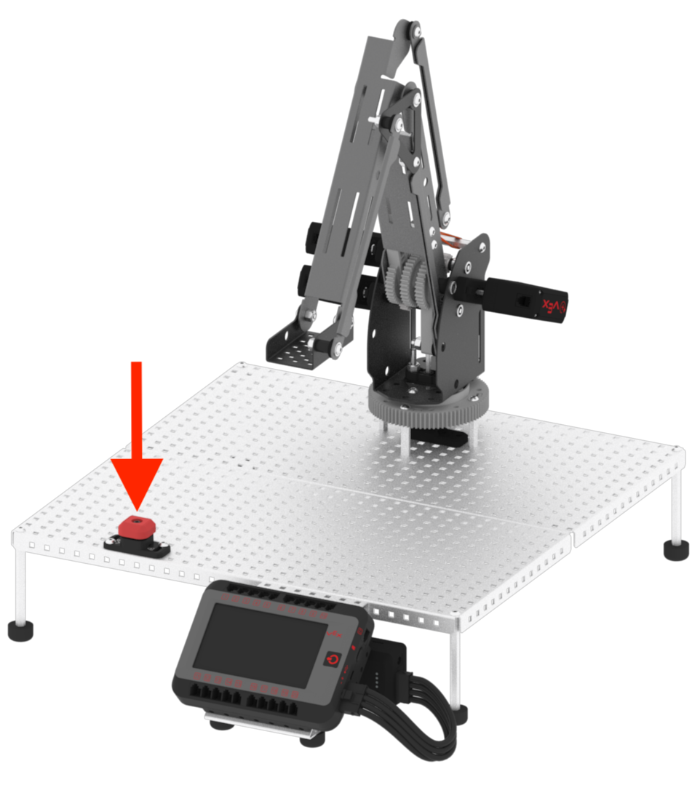

category: arm  
signature: RoboticArm.emergencyStop();  
device_class: RoboticArm  
description: Activates the emergency stop (or E-stop) button for the V5 Robotic Arm.  

# Activate emergency stop

Activates the emergency stop (or E-stop) button for the V5 Robotic Arm.

```cpp
RoboticArm.emergencyStop();
```

## How To Use

The emergency stop button in the Workcell will shut off any V5 Smart Motors and Sensors connected to the V5 Brain. 



The `RoboticArm.emergencyStop();` command is often used with the `bumper.pressed()` command from the Events category. This ensures that all V5 Smart Motors and Sensors connected to the V5 Brain will shut off once the Bumper Switch (E-stop) is pressed.

```cpp
void onEstop() {
  arm.emergencyStop();
}

int main() {
  emergencyStopButton.pressed(onEstop);
}
```

<advanced>
</advanced>