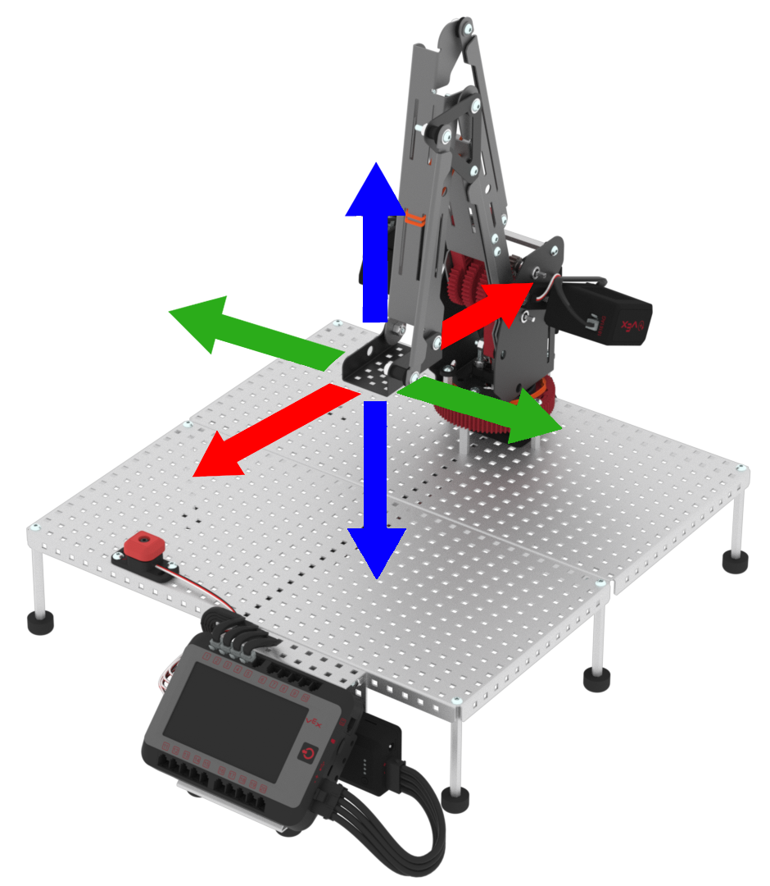

category: arm  
signature: RoboticArm.enableManualMovement();  
device_class: RoboticArm  
description: Allows the arm of the V5 Workcell to be manually moved by hand.

# Enable manual movement

Allows the arm of the V5 Workcell to be manually moved by hand.

```cpp
RoboticArm.enableManualMovement();
```

## How To Use

By default, the motors on the Workcell lock in place when a project is running. To be able to manually move the arm, use the `RoboticArm.enableManualMovement();` command in your project.



<advanced>
</advanced>