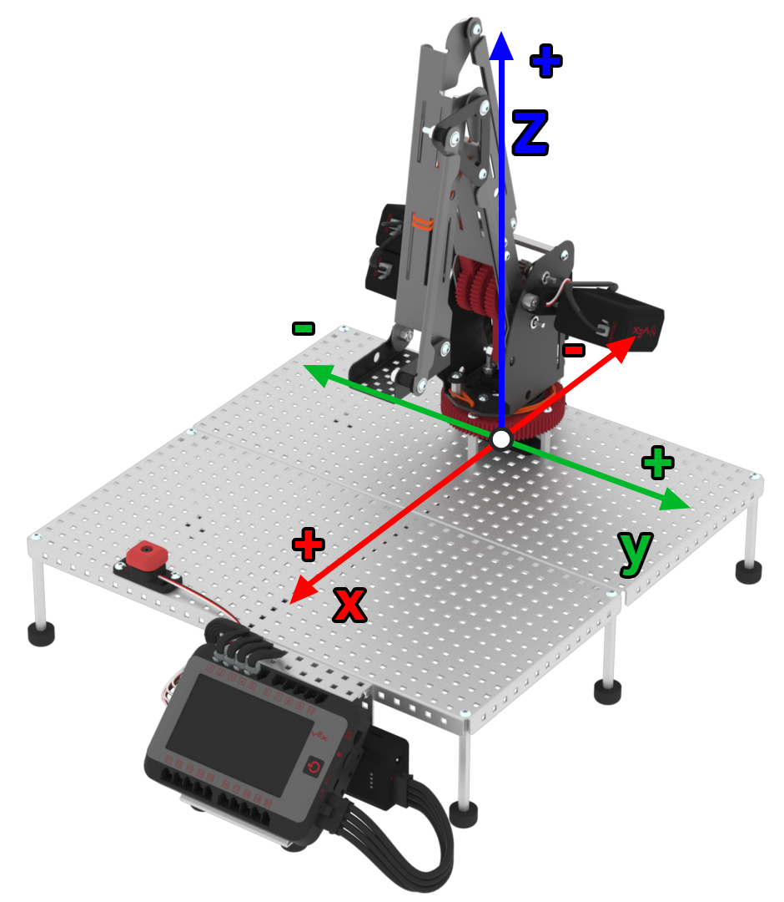

category: arm  
signature: RoboticArm.moveToPositionLinear(0, 0, 0);  
device_class: RoboticArm  
description: Moves the V5 Robotic Arm to the specified (x, y, z) coordinate using linear movement.  

# Linear move

Moves the V5 Robotic Arm to the specified (x, y, z) coordinate using linear movement.

```cpp
RoboticArm.moveToPositionLinear(0, 0, 0);
```

## How To Use

The `RoboticArm.moveToPositionLinear(0, 0, 0);` command moves the V5 Robotic Arm in the x, y, and z-direction using linear movement. 

The default position is (0, 0, 0) in the unit of inches.



<advanced>
</advanced>