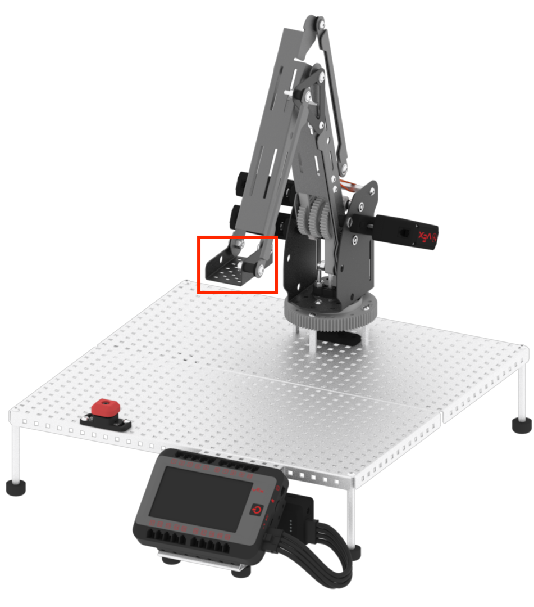

category: arm  
signature: RoboticArm.setArmAngle(0);  
device_class: RoboticArm  
description: Sets the angle of the tool plate before the next linear or joint movement command is executed.  

# Set angle

Sets the angle of the tool plate before the next linear or joint movement command is executed.

```cpp
RoboticArm.setArmAngle(0);
```

## How To Use

The `RoboticArm.setArmAngle(0)` command sets the tool plate to be tilted at the specified angle in degrees, before the next linear or joint movement command in a project.

Note that the `RoboticArm.setArmAngle(0)` command sets the angle for all future linear or joint movement commands, unless it is set otherwise.



Choose the angle of the tool plate. The default is set to **90** degrees. The accepted range is **0** to **90** degrees.

* The tool plate will be **horizontal**, or parallel to the Workcell surface when it is set to 0 degrees.
* The tool plate will be **vertical**, or perpendicular to the Workcell surface when it is set to 90 degrees.

## Example

In this example, the tool plate will begin to tilt once the joint move command is executed and complete its tilting movement before the linear move command.

```cpp
RoboticArm.setMasteringValues(1802, 2212, 1556, 369);
RoboticArm.setArmAngle(90);
RoboticArm.moveToPositionJoint(10, -2.8, 3);
RoboticArm.moveToPositionLinear(9, 4.53, 3.5);
```

<advanced>
</advanced>