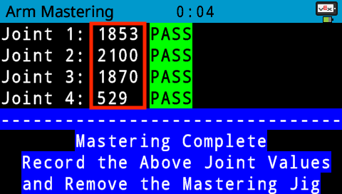

category: arm  
signature: RoboticArm.setMasteringValues(0, 0, 0, 0);  
device_class: RoboticArm  
description: Sets the mastering values of the four joints of the V5 Robotic Arm.  

# Set mastering

Sets the mastering values of the four joints of the V5 Robotic Arm to allow it to be calibrated to the same known location.

```cpp
RoboticArm.setMasteringValues(0, 0, 0, 0);
```

## How To Use

Input the mastering values from the V5 Brain to the `RoboticArm.setMasteringValues(0, 0, 0, 0)` command. 

The passable threshold values for the joints are as follows:

* Joint 1: 1600 - 2000
* Joint 2: 1900 - 2400
* Joint 3: 1700 - 2100
* Joint 4: 200 - 650



<advanced>
</advanced>