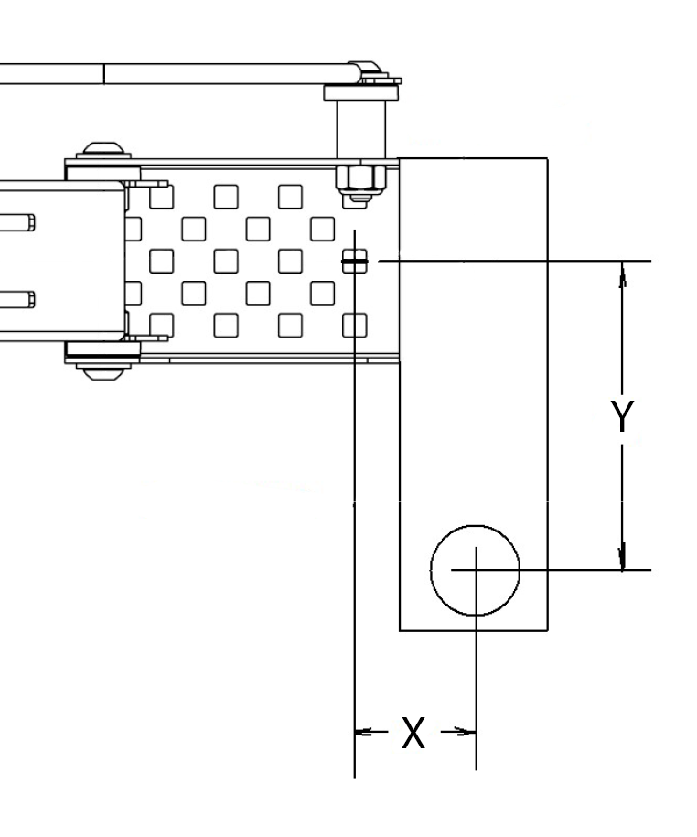
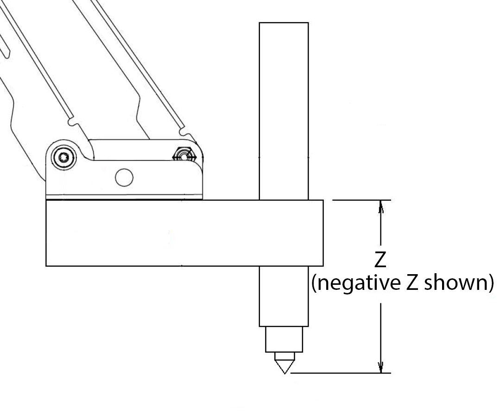

category: arm  
signature: RoboticArm.setToolTipOffset(0.0, 0.0, 0.0);  
device_class: RoboticArm  
description: Reports the height of a detected object from the Vision Sensor.  

# Set tool offset

Sets the position offset for the end effector or the end-of-arm tooling (EOAT) on the V5 Robotic Arm.

```cpp
RoboticArm.setToolTipOffset(0.0, 0.0, 0.0);
```

## How To Use

The end effector on the V5 Robotic Arm can be at a position relative to the attachment plate on the arm. To keep the coordinate space the same, you can specify the tool offsets.

```cpp
RoboticArm.setToolTipOffset(dr, dp, dz);
```

* **dr** - the distance along the X-axis from the end of the attachment plate.
* **dp** - the distance along the Y-axis from the center of the attachment plate.



* **dz** - the distance along the Z-axis from the bottom of the attachment plate.



The default coordinates for none, electromagnet, and marker are the following:

* **none**: (0.0, 0.0, 0.0)
* **electromagnet**: (-0.7, 0.0, -2.0)
* **marker**: (1.05, 0.0, -1.0)

<advanced>
</advanced>