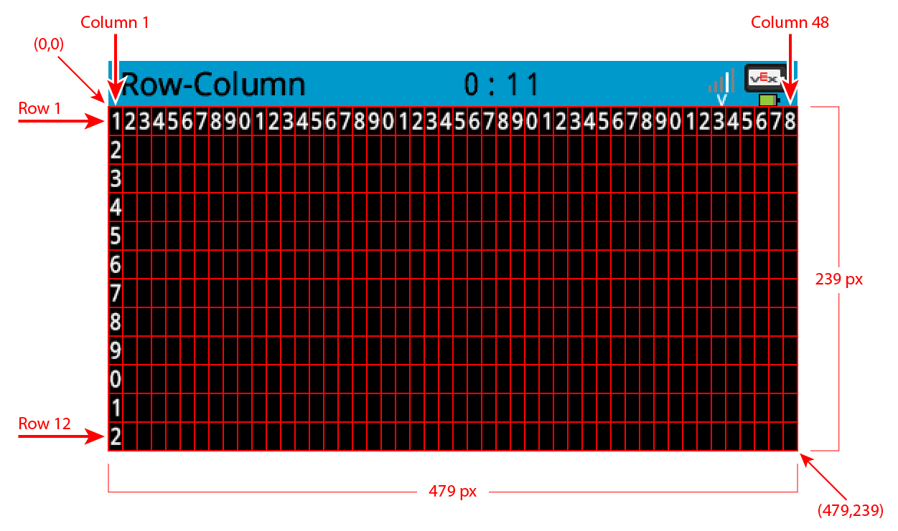

category: looks  
signature: Brain.Screen.setPenWidth(10);  
description: Sets the width of the outline for shapes drawn on the V5 Brain's screen.  

# Brain Screen Set Pen Width

Sets the width of the outline for shapes drawn on the V5 Brain's screen.

```cpp
Brain.Screen.setPenWidth(5);
```

## How To Use

The `Brain.Screen.setPenWidth();` command is used to set the width of the line on the outside of circles and rectangles drawn on the V5 Brain's screen. 

The `Brain.Screen.setPenWidth();` command can accept integer values, with a larger value equating to a larger width.



<advanced>
</advanced>