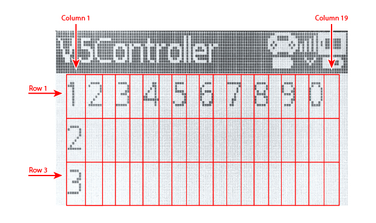

category: looks  
signature: CONTROLLER.Screen.setCursor(1, 1);  
device_class: controller  
description: Sets the cursor location for **Controller.Screen.print();** command on the V5 Controller's screen.

# Controller Screen Set Cursor

Sets the cursor location for **Controller.Screen.print();** command on the V5 Controller's screen.

```cpp
Controller.Screen.setCursor(1, 2);
```

## How To Use

The `Controller.Screen.setCursor();` command requires 2 values:

* Value 1: Screen row position 
* Value 2: Screen column position

Set the cursor's row and column position to have a `Controller.Screen.print();` command display at a specific location on the screen.

`Controller.Screen.setCursor();` accepts a range for **row** of **1 to 3**.

`Controller.Screen.setCursor();` accepts a range for **column** of **1 to 20**.

---

The V5 Controller does not allow you to change the size of the font printed on the screen.

**V5 Controller Font Size - Number of Rows:**

* Standard Font - 3 Rows (Default)

**V5 Controller Font Size - Number of Columns:**

* Standard Font - 20 Columns (Default)



<advanced>
</advanced>