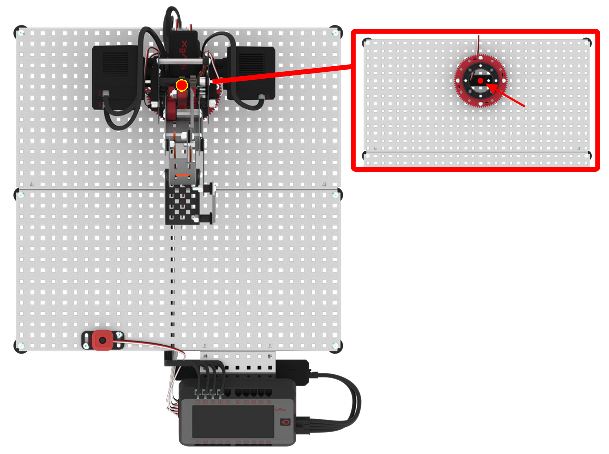
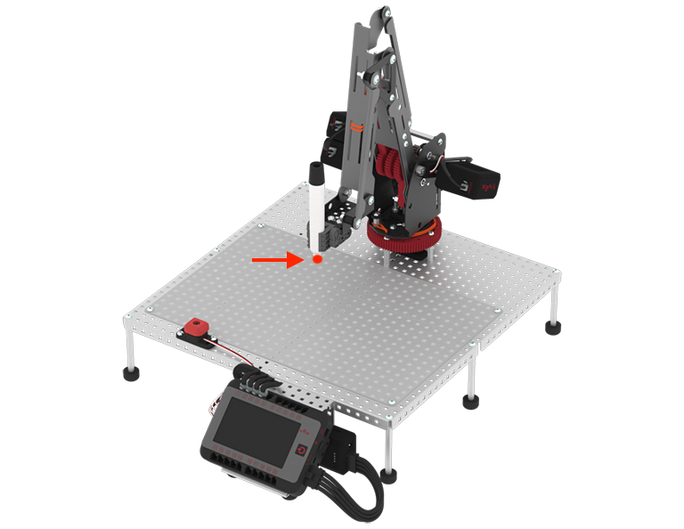

category: arm  
signature: RoboticArm.setRelativePosition(0, 0, 0);  
device_class: RoboticArm  
description: Sets the origin to the current location of the end of arm tooling.

# Set relative position

Sets the origin to the current location of the end of arm tooling.

```cpp
RoboticArm.setRelativePosition(0, 0, 0);
```

## How To Use

By default, the origin on the Workcell is located in the center of the turntable.


The `RoboticArm.setRelativePosition(0, 0, 0);` command sets the origin to the current location of the end of arm tooling.

The end of arm tooling can be set to:

* None
* Marker (shown in image)
* Electromagnet 



<advanced>
</advanced>