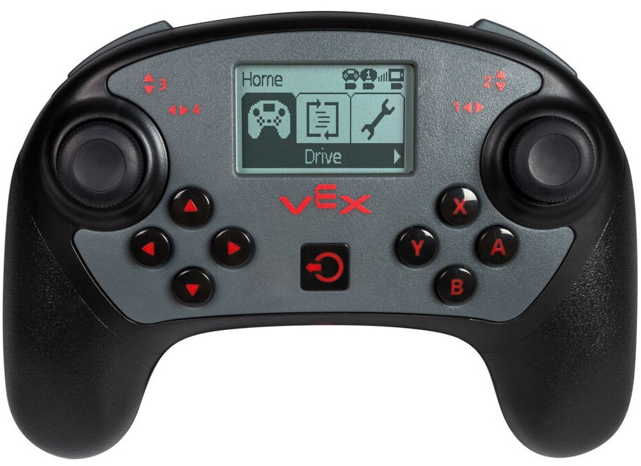

category: sensing  
signature: CONTROLLER.AXIS.position()  
device_class: controller  
description: Reports the position of a joystick on the V5 Controller along an axis.  

# Controller Axis Position

Reports the position of a joystick on the V5 Controller along an axis.

```cpp
Controller.Axis.position()
```

## How To Use
Commands that return a value are normally used inside of other statements (such as print statements) or inside of control structures (such as while loops) and do not use a semicolon.

`Controller.Axis.position()` reports a range between **-100 to 100**.

`Controller.Axis.position()` will report zero (0) when a joystick axis is centered.

Choose which Controller axis to report.

* `Axis1` - right Joystick (left and right)
* `Axis2` - right Joystick (up and down)
* `Axis3` - left Joystick (up and down)
* `Axis4` - left Joystick (left and right)




```cpp
ArmMotor.setVelocity(Controller1.Axis3.position(), percent);
```
<advanced>
</advanced>