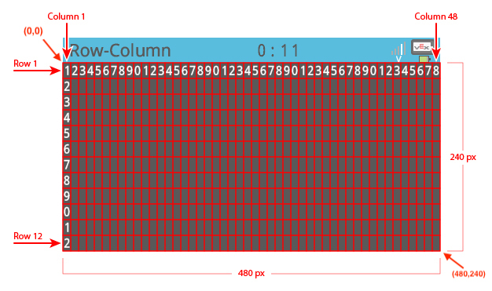

category: sensing  
signature: Brain.Screen.yPosition()  
description: Reports the Y coordinate of the location of the last detected touch on the V5 Brain's touchscreen.

# # Aivojen näytön y-arvo

Antaa Y-koordinaatin, johon viimeksi koskettu V5 Aivojen kosketusnäytössä.

```cpp
Brain.Screen.yPosition()
```

## Miten käytetään

`Brain.Screen.yPosition()` kaappaa viimeisimmän näytön kosketuksen x -koordinaatin. 

Yhdessä komennon  `Brain.Screen.xPosition()`  saa molemmat koordinaatit (x,y), jolloin interaktiivisuutta voi lisätä käyttäjän ja V5 aivojen välillä.


`Brain.Screen.yPosition()` antaa kokonaisluvun **integer** arvovälillä **0 - 240 pixeliä**.



```cpp
int myYCoordinate = Brain.Screen.yPosition();
```

<advanced>
</advanced>
