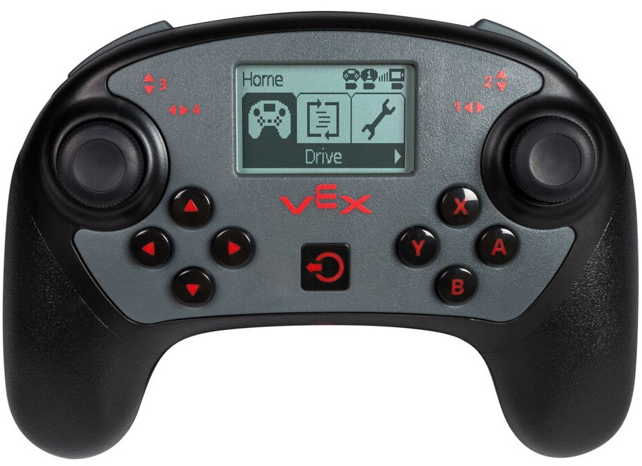

category: sensing  
signature: CONTROLLER.AXIS.position()  
device_class: controller  
description: Reports the position of a joystick on the V5 Controller along an axis.  

# Ohjaimen tatin asento
 
Antaa V5 -ohjaimen tatin asennon.

```cpp
Controller.Axis.position()
```
## Miten käytetään

`Controller.axis1.position` antaa arvot välillä **-100 - 100**.

`Controller.axis1.position` antaa arvon nolla (0) ,kun se on keskellä.

Valitse tatti, jota käytät.

* Axis1 - oikea Joystick (vasen - oikea)
* Axis2 - oikean Joystick (ylös - alas)
* Axis3 - vasen Joystick (ylös - alas)
* Axis4 - vasen Joystick (vasen - oikea)
* 



```cpp
ArmMotor.setVelocity(Controller1.Axis3.position(), percent);
```
<advanced>
</advanced>