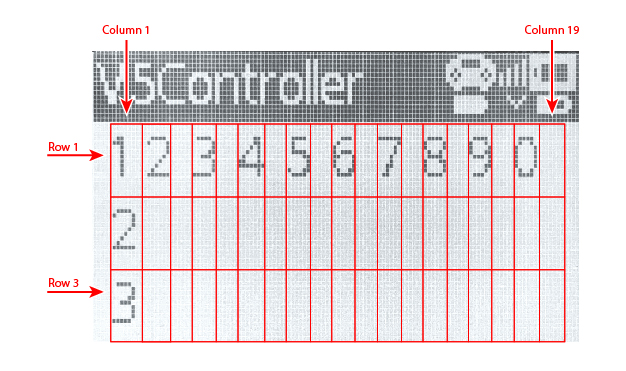

category: sensing  
signature: CONTROLLER.Screen.row()  
device_class: controller  
description: Reports the row number of the V5 Controller screen cursor location.

# Kursorin rivi

Antaa ohjaimen näytön kursorin rivin.


```cpp
Controller.Screen.row()
```

## Miten käytetään

`Controller.Screen.row()` antaa arvot välillä **1 - 3**.

```cpp
if (Controller1.Screen.row() > 2) {
}
```

---

V5 ohjaimen näytöllä fonttia ei voi muuttaa.

**V5 Ohjain Fontti Koko - Rivimäärä:**

* Standardi Fontti - 3 Riviä (Oletus)




<advanced>
</advanced>