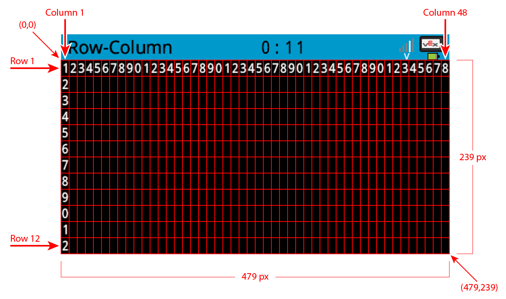

category: looks  
signature: brain.screen.set_pen_width(10)  
description: Sets the width of the outline for shapes drawn on the V5 Brain's screen.  

# Set Pen Width

Sets the width of the outline for shapes drawn on the V5 Brain's screen.

```don
brain.screen.set_pen_width(PEN_WIDTH)
```

## How To Use

The `brain.screen.set_pen_width()` command is used to set the width of the line on the outside of circles and rectangles drawn on the V5 Brain's screen. 

The `brain.screen.set_pen_width()` command can accept integer values, with a larger value equating to a larger width. Replace the `PEN_WIDTH` parameter with an integer value.



<advanced>
</advanced>
