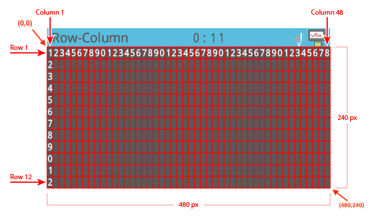

category: looks  
signature: brain.screen.clear_line()  
description: Clears a single row on the V5 Brain screen.  

# Tyhjää rivi

Tyhjää yksittäisen rivin V5 aivojen tai ohjaimen näytöllä.

```don 
brain.screen.clear_row()
```

## Miten käytetään

Tyhää nykyisen kursoririvin.

```don
brain.screen.clear_row()
```

Tyhjää tietyn rivin näytöllä.

```don
brain.screen.clear_row(ROW)
```

## Miten käytetään

`brain.screen.clear_row()` komento hyväksyy arvot välillä **1 - 20**, jonka rivin tyhjää. Ilman rivinumero komento tyhjää nykyisen rivin.

---



<advanced>
</advanced>
