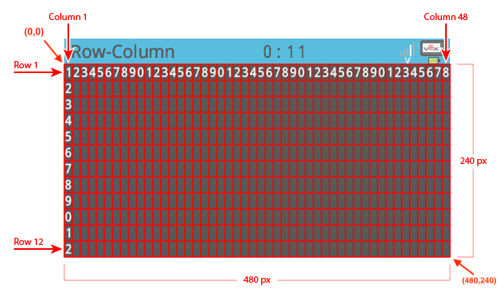

category: looks  
signature: brain.screen.draw_rectangle(1, 1, 10, 10)  
description: Draws a rectangle on the V5 Brain's screen.  

# Piirrä suorakulmio

Piirtää suorakulmion V5 Aivojen näytölle.

```don
brain.screen.draw_rectangle(X, Y, WIDTH, HEIGHT)
```

## Miten käytetään

Komento `brain.screen.draw_rectangle()` vaatii 4 arvoa:

* Arvo 1: Ylä vasen nurkka X koordinaatti
* Arvo 2: Ylä vasen nurkka Y koordinaatti
* Arvo 3: Leveys kulmiolle
* Arvoe 4: Korkaus kulmiolle

Komento `brain.screen.set_pen_color()` määrää reunaviivan värin. Oletus on valkoinen.

Täyttöväri saadaan komennolla `brain.screen.set_fill_color()`. Oletus on musta täyttöväri.



<advanced>
</advanced>
