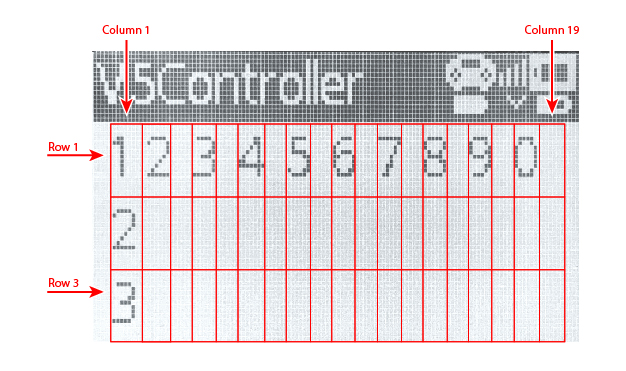

category: looks  
signature: controller.screen.set_cursor(1, 1)  
description: Sets the cursor location for **controller.screen.print()** command on the V5 Controller's screen.

# Aseta kursoripaikka


Asettaa kursorin paikan ohjaimen näytöllä.

```don
controller.screen.set_cursor(ROW, COLUMN)
```

## Miten käytetään

Komento `controller.screen.set_cursor()` vaatii 2 arvoa:

* Value 1: Näytön rivi 
* Value 2: Näytön sarake

Asettamalla kursori sopiva rivi ja sarake saat tulostettua komennolla `controller.screen.print()` haluttuun kohtaan näyttöä.

`controller.screen.set_cursor()` hyväksyy rivin **row** välillä **1 - 3**.

`controller.screen.set_cursor()` hyväksyy sarakkeen **column** välillä **1 - 20**.

---

V5 Ohjainnäytölle ei voi muuttaa fontin kokoa.

**V5 Ohjain Fontin koko - Rivien määrä:**

* Standard Fontti - 3 riviä (Oletus)

**V5 Ohjain Fontin koko - Sarakkeiden määrä**

* Standard Fontti - 20 Saraketta (Oletus)



<advanced>
</advanced>
